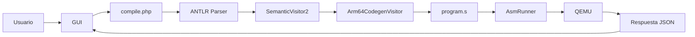
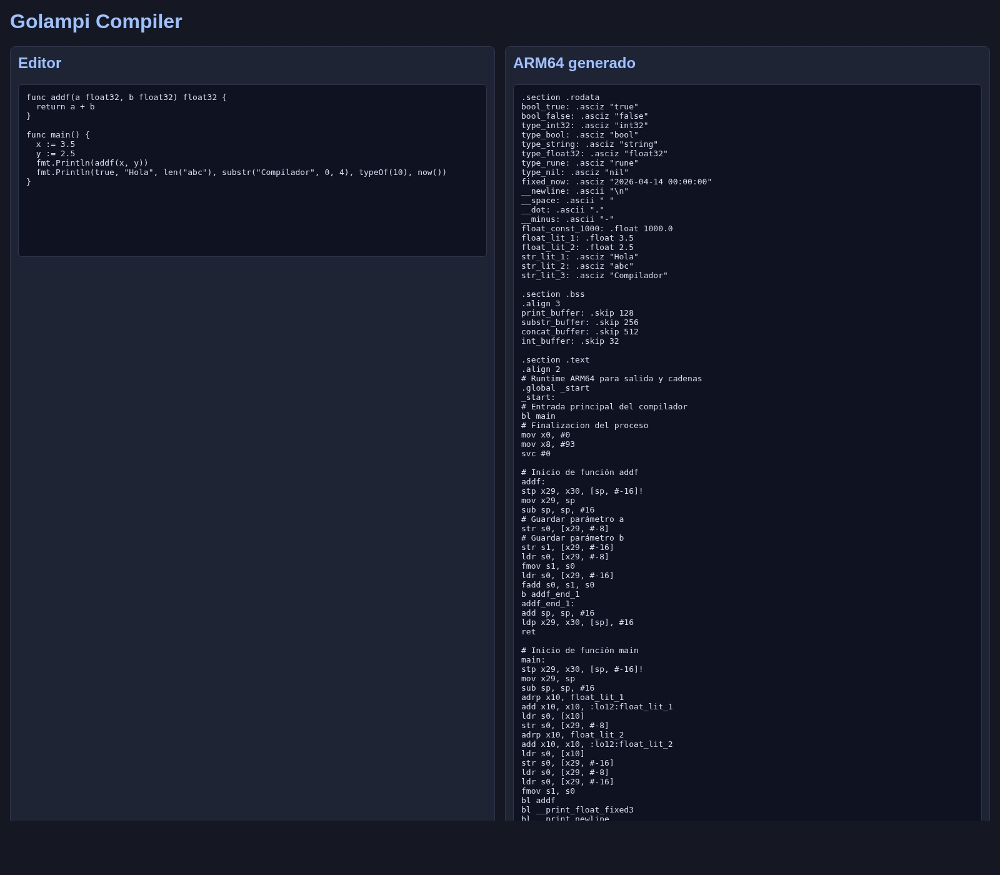
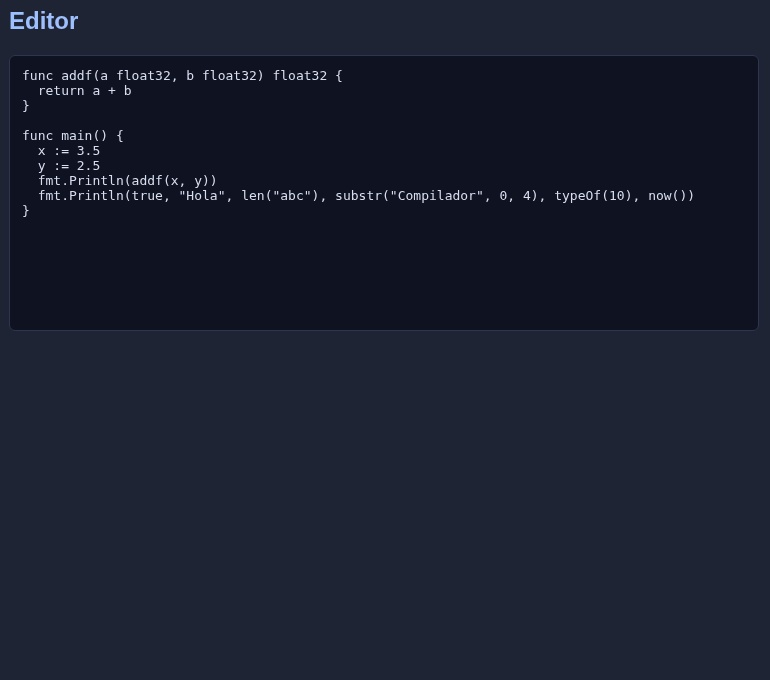
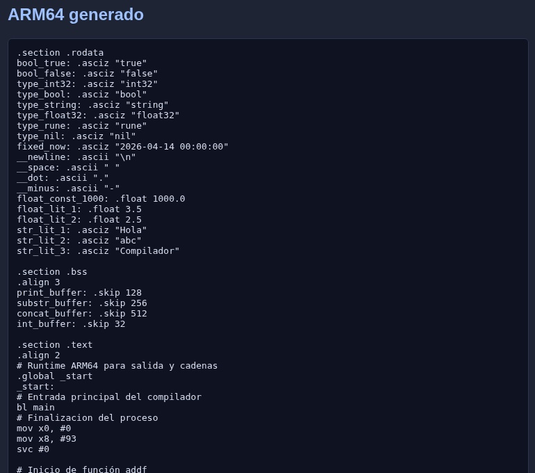

# Explicacion Del Proyecto

## ¿Que es este proyecto?
Este proyecto es un compilador del lenguaje Golampi.

Golampi es un lenguaje academico parecido a Go. El sistema recibe codigo escrito por el
usuario, lo analiza, lo traduce a ensamblador ARM64, ensambla el resultado, crea un
ejecutable y lo corre con QEMU para mostrar la salida.

En palabras simples:

1. El usuario escribe codigo Golampi.
2. El compilador revisa si el codigo esta bien escrito.
3. Si todo esta correcto, genera codigo ARM64 real.
4. Luego lo ejecuta y muestra el resultado.

## ¿Como funciona el compilador?

### Paso 1: Entrada de codigo
El usuario escribe el programa en la GUI de `Proyecto2/frontend/`.

La interfaz envia el codigo al backend PHP usando una peticion HTTP.

### Paso 2: ANTLR
El backend no rehace la gramatica. Reutiliza ANTLR del Proyecto 1 (artefactos en `Proyecto1/backend/`).

Eso significa que:
- el lexer ya sabe separar tokens
- el parser ya sabe construir el arbol sintactico
- el compilador nuevo trabaja sobre ese arbol

Archivo importante:
- `Proyecto2/backend/bootstrap/antlr.php`

Ese archivo carga el lexer, parser y visitor generados anteriormente.

### Paso 3: Analisis semantico
Despues del parseo, el sistema revisa si el programa tiene sentido.

Ejemplos de cosas que revisa:
- variables declaradas
- tipos correctos
- uso correcto de funciones
- cantidad de retornos
- reglas de `main`
- `if`, `for` y `switch`

Archivo importante:
- `Proyecto2/backend/src/Semantic/SemanticVisitor2.php`

Este visitor construye la tabla de simbolos y registra errores semanticos.

### Paso 4: Generacion de codigo ARM64
Si no hay errores semanticos, el compilador recorre el arbol otra vez.

Ahora el objetivo no es validar, sino traducir.

Se convierten las construcciones Golampi a instrucciones ARM64 como:
- `add`
- `sub`
- `mul`
- `sdiv`
- `fadd`
- `fsub`
- `fmul`
- `fdiv`
- `cmp`
- `b.eq`, `b.ne`, `b.lt`, `b.gt`

Archivo importante:
- `Proyecto2/backend/src/Codegen/Arm64CodegenVisitor.php`

Este es el corazon del backend ARM64.

### Paso 5: Ensamblado, enlace y ejecucion
Cuando el codigo ensamblador ya esta listo:

1. Se escribe el archivo `.s`
2. Se ejecuta el ensamblador ARM64
3. Se ejecuta el linker
4. Se corre el binario con `qemu-aarch64`

Archivo importante:
- `Proyecto2/backend/src/Codegen/AsmRunner.php`

Este modulo detecta el toolchain y corre el binario real.

### Paso 6: Respuesta a la GUI
El backend devuelve:
- ensamblador generado
- errores
- tabla de simbolos
- salida de ejecucion real

La GUI muestra todo esto en pantalla.

## Flujo completo



## Estructura del proyecto

### `Proyecto2/backend/`
Aqui vive toda la logica del compilador.

Subcarpetas importantes:
- `bootstrap/`: conecta Proyecto2 con ANTLR del Proyecto 1
- `public/`: endpoint HTTP
- `src/Pipeline/`: orquesta parseo, semantica, codegen y ejecucion
- `src/Semantic/`: tipos, tabla de simbolos y visitor semantico
- `src/Codegen/`: generacion ARM64 y ejecucion con QEMU
- `src/Reports/`: reportes de errores y simbolos

### `Proyecto2/frontend/`
Aqui esta la interfaz grafica.

Incluye:
- `index.html`
- `styles.css`
- `app.js`

La GUI no compila por si sola. Solo envia codigo al backend y muestra resultados.

### `Proyecto2/output/asm/`
Aqui se guarda el ensamblador generado:
- `program.s`
- `program.o`
- `program`

### `Proyecto2/docs/`
Aqui vive la documentacion del proyecto.

## Archivos importantes

### `CompilerPipeline.php`
Ruta:
- `Proyecto2/backend/src/Pipeline/CompilerPipeline.php`

Funcion:
- coordina todo el flujo del compilador
- parsea
- valida
- genera asm
- ejecuta con QEMU

Es como el director de orquesta.

### `Arm64CodegenVisitor.php`
Ruta:
- `Proyecto2/backend/src/Codegen/Arm64CodegenVisitor.php`

Funcion:
- convierte el arbol de ANTLR en instrucciones ARM64 reales

Aqui se traduce `if`, `for`, operaciones, funciones, built-ins y tipos.

### `AsmRunner.php`
Ruta:
- `Proyecto2/backend/src/Codegen/AsmRunner.php`

Funcion:
- toma `program.s`
- llama al ensamblador
- llama al linker
- ejecuta el binario con QEMU
- captura la salida

### `SemanticVisitor2.php`
Ruta:
- `Proyecto2/backend/src/Semantic/SemanticVisitor2.php`

Funcion:
- revisa si el programa es valido
- detecta errores semanticos
- construye la tabla de simbolos

## Funciones importantes

### `fmt.Println`
Imprime uno o mas valores en consola.

En este proyecto:
- convierte enteros a texto
- imprime bool como `true` o `false`
- imprime strings
- imprime `float32` con formato fijo
- usa syscall `write` en ARM64

### `len`
Devuelve la longitud de un string o de un arreglo.

Ejemplo:

```go
func main() {
    fmt.Println(len("Hola"))
}
```

### `substr`
Extrae una parte de un string.

Ejemplo:

```go
func main() {
    fmt.Println(substr("Compilador", 0, 4))
}
```

Salida:

```text
Comp
```

### `typeOf`
Devuelve el nombre del tipo.

Ejemplo:

```go
func main() {
    fmt.Println(typeOf(10))
}
```

Salida:

```text
int32
```

### `now`
Devuelve una cadena con fecha y hora.

En la implementacion actual se usa una cadena fija en el runtime ARM64 para simplificar
la ejecucion academica.

## Ejemplo completo

### Codigo Golampi

```go
func addf(a float32, b float32) float32 {
    return a + b
}

func main() {
    x := 3.5
    y := 2.5
    fmt.Println(addf(x, y))
}
```

### Idea del ensamblador generado

El compilador genera una funcion `addf`, carga valores `float32`, usa `fadd` y luego
llama a una rutina de impresion para mostrar el resultado.

### Salida real

```text
6.000
```

## Capturas reales

Las siguientes imagenes muestran el sistema real.








## Conclusión
Este proyecto convierte una entrada Golampi en un binario ARM64 real.

Lo importante no es solo que analice texto, sino que:
- valida el programa
- genera ensamblador
- lo ejecuta
- muestra el resultado en la GUI

Eso lo convierte en un compilador funcional y explicable para exposicion.
