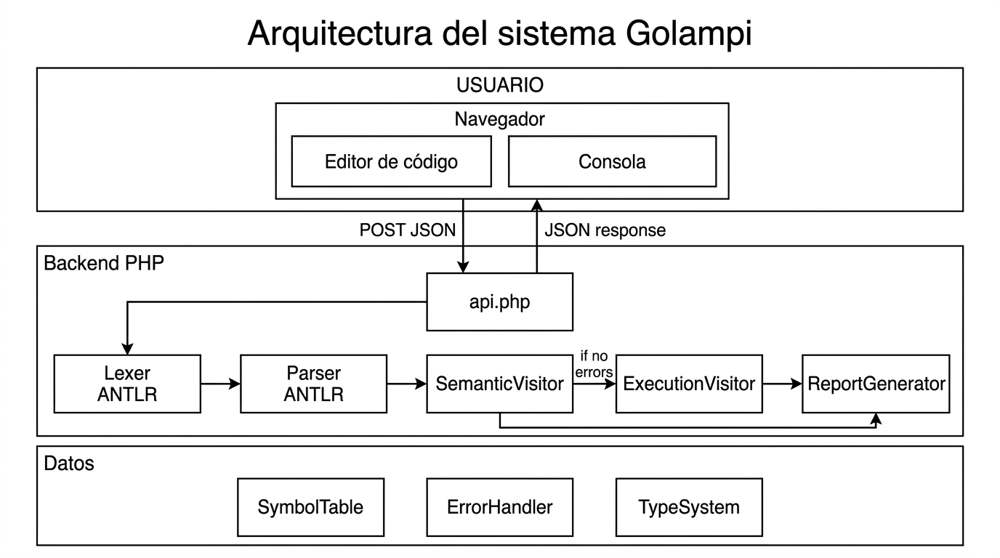
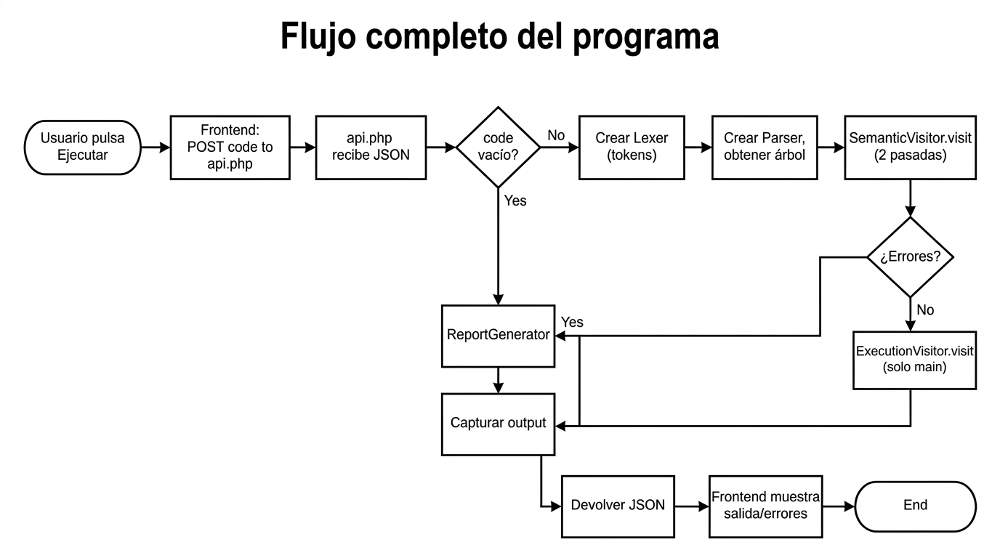
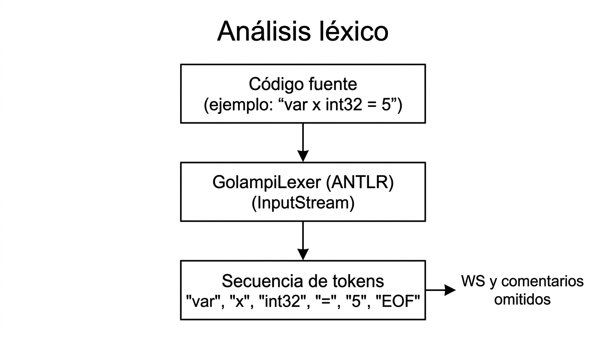
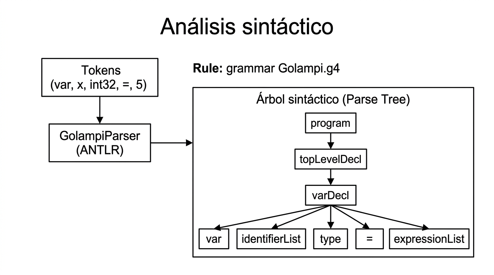
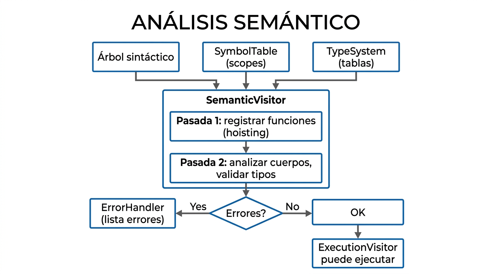
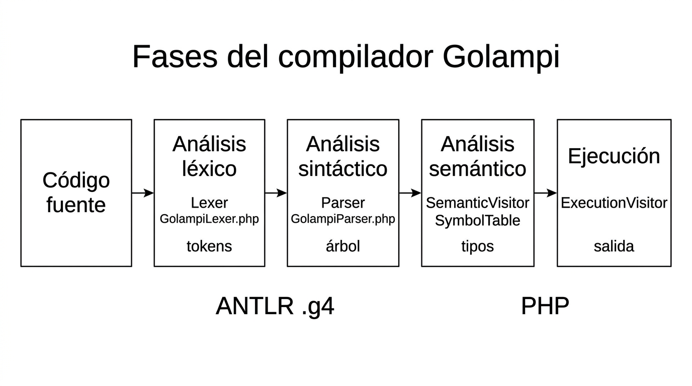
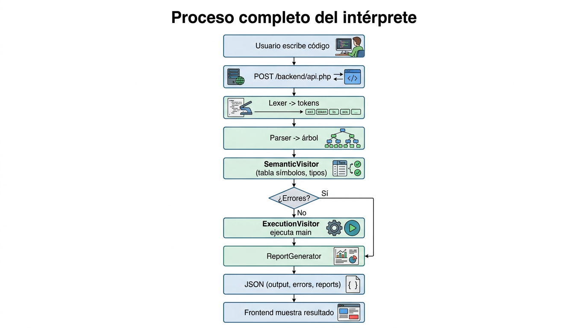

# Documentación completa del compilador Golampi

**Objetivo:** Guía educativa, clara y profunda para entender y defender el proyecto en una evaluación académica.  
**Lenguaje:** Golampi (especificación tipo Go).  
**Tipo de sistema:** Intérprete con análisis léxico, sintáctico y semántico.

---

## Índice

1. [Visión general del proyecto](#1-visión-general-del-proyecto)
2. [Arquitectura general del proyecto](#2-arquitectura-general-del-proyecto)
3. [Flujo completo del programa](#3-flujo-completo-del-programa)
4. [Explicación archivo por archivo](#4-explicación-archivo-por-archivo)
5. [Partes del compilador implementadas](#5-partes-del-compilador-implementadas)
6. [Explicación profunda de los métodos más importantes](#6-explicación-profunda-de-los-métodos-más-importantes)
7. [Relación entre el PDF del enunciado y el código](#7-relación-entre-el-pdf-del-enunciado-y-el-código)
8. [Diagramas importantes](#8-diagramas-importantes-imágenes)
9. [Guía para modificar el programa](#9-guía-para-modificar-el-programa)
10. [Posibles preguntas de defensa del proyecto](#10-posibles-preguntas-de-defensa-del-proyecto)
11. [Guía paso a paso para defender el proyecto](#11-guía-paso-a-paso-para-defender-el-proyecto)
12. [Ejercicios de modificación](#12-ejercicios-de-modificación)
13. [Resumen final para estudiar](#13-resumen-final-para-estudiar)

---

## 1. Visión general del proyecto

### ¿Qué hace el programa?

El proyecto es un **intérprete** para el lenguaje **Golampi**: recibe código fuente escrito en Golampi, lo **analiza** (léxico, sintáctico y semántico) y, si no hay errores, **ejecuta** el programa. La ejecución comienza en la función `main()` y produce salida (por ejemplo con `fmt.Println`). Además genera **reportes** de errores y tabla de símbolos que el usuario puede ver en consola o descargar.

### ¿Qué problema resuelve?

- Permite **escribir y ejecutar** programas en un lenguaje académico definido por una especificación (PDF del enunciado).
- **Detecta y reporta** errores léxicos, sintácticos y semánticos **sin parar al primer error**, para que el programador pueda corregir varios fallos a la vez.
- Ofrece una **interfaz web** para editar código, ejecutarlo y descargar reportes, sin necesidad de usar la línea de comandos.

### ¿Qué tipo de compilador o simulador se implementó?

| Concepto | Respuesta |
|----------|-----------|
| **Tipo** | Intérprete (no genera código objeto ni código máquina). |
| **Fases** | Análisis léxico y sintáctico (ANTLR4) + análisis semántico (Visitor en PHP) + ejecución (Visitor en PHP). |
| **Salida** | Ejecución directa (salida por consola) + reportes en texto/HTML. |

### ¿Cómo se ejecuta el programa?

1. **Desde la raíz del proyecto:** `php -S 0.0.0.0:8000`
2. En el navegador: `http://localhost:8000/frontend/index.html`
3. Escribir código Golampi en el editor y pulsar **Ejecutar / Analizar**.

Por línea de comandos (sin interfaz):

```bash
echo 'func main() { fmt.Println("Hola") }' | php backend/snippet_runner.php
```

Para probar el pipeline completo sobre un archivo:

```bash
php backend/test_parser.php
```

(Usa `tests/test.golampi` por defecto.)

### ¿Qué entrada recibe?

- **Interfaz web:** texto del editor (código Golampi) enviado por POST a `backend/api.php` en JSON: `{ "code": "..." }`.
- **Línea de comandos:** código por STDIN (`snippet_runner.php`) o contenido de `tests/test.golampi` (`test_parser.php`).

### ¿Qué salida produce?

| Salida | Descripción |
|--------|-------------|
| **Consola** | Salida estándar del programa (lo impreso con `fmt.Println`). |
| **Errores** | Lista de errores (tipo, mensaje, línea, columna) en tabla en la consola o en reporte descargable. |
| **Tabla de símbolos** | Identificador, tipo, ámbito, valor (si aplica), línea, columna; descargable. |
| **JSON (API)** | `ok`, `output`, `errors`, `symbolTable`, `reportResult`, `reportErrors`, `reportSymbols`. |

### ¿Qué tecnologías usa el proyecto?

| Componente | Tecnología |
|------------|------------|
| Backend | PHP 8.x |
| Análisis léxico y sintáctico | ANTLR4 (gramática en `.g4`, código generado en PHP) |
| Frontend | HTML, CSS, JavaScript (sin frameworks) |
| Comunicación | HTTP; el frontend envía POST y recibe JSON |
| Dependencias | Composer; runtime ANTLR4 para PHP |

---

## 2. Arquitectura general del proyecto

### Estructura de carpetas

```
golampi-interpreter/
├── backend/                    # Lógica del intérprete
│   ├── grammar/
│   │   └── Golampi.g4           # Gramática ANTLR4 (léxico + sintaxis)
│   ├── generated/               # Código generado por ANTLR (no editar a mano)
│   │   ├── GolampiLexer.php
│   │   ├── GolampiParser.php
│   │   ├── GolampiVisitor.php
│   │   └── GolampiBaseVisitor.php
│   ├── src/
│   │   ├── interpreter/         # SymbolTable, Symbol, Type, TypeSystem, Value, BuiltIns
│   │   ├── Visitors/            # SemanticVisitor, ExecutionVisitor
│   │   └── Utils/               # ErrorHandler, ReportGenerator
│   ├── api.php                  # Punto de entrada HTTP
│   ├── snippet_runner.php        # Ejecución por STDIN
│   ├── test_parser.php          # Pruebas del pipeline
│   ├── composer.json
│   └── vendor/                  # Dependencias (ANTLR, etc.)
├── frontend/
│   └── index.html               # Interfaz: editor, consola, reportes
├── docs/                        # Documentación
│   └── diagramas/               # Imágenes de diagramas
├── tests/
│   └── test.golampi             # Caso de prueba
├── Proyecto1.pdf                # Enunciado del lenguaje (si está en el repo)
└── README.md
```

### Módulos principales

| Módulo | Ubicación | Responsabilidad |
|--------|-----------|-----------------|
| **Gramática** | `backend/grammar/Golampi.g4` | Define tokens y reglas gramaticales; ANTLR genera lexer y parser. |
| **Léxico/Sintaxis** | `backend/generated/GolampiLexer.php`, `GolampiParser.php` | Tokenización y construcción del árbol sintáctico. |
| **Semántica** | `backend/src/Visitors/SemanticVisitor.php` | Tabla de símbolos, validación de tipos, scopes, return, built-ins. |
| **Ejecución** | `backend/src/Visitors/ExecutionVisitor.php` | Evaluación de expresiones, asignaciones, llamadas a funciones, salida. |
| **Datos** | `backend/src/interpreter/` | SymbolTable, Type, TypeSystem, Value, BuiltIns. |
| **Errores y reportes** | `backend/src/Utils/ErrorHandler.php`, `ReportGenerator.php` | Acumulación de errores y generación de reportes. |
| **API** | `backend/api.php` | Entrada HTTP, orquestación del pipeline, respuesta JSON. |
| **Frontend** | `frontend/index.html` | Editor, consola, botones, descarga de reportes. |

### Archivos importantes y responsabilidades

- **Golampi.g4:** Fuente de verdad de la sintaxis y tokens; no se edita el código generado, se regenera con ANTLR.
- **SemanticVisitor.php:** Implementa el análisis semántico en dos pasadas (hoisting de funciones y análisis de cuerpos).
- **ExecutionVisitor.php:** Implementa la ejecución; solo ejecuta el bloque de `main` (y desde ahí las llamadas a otras funciones).
- **SymbolTable.php:** Pila de ámbitos; cada ámbito es un mapa nombre → Symbol.
- **TypeSystem.php:** Tablas estáticas de compatibilidad de tipos para operadores y asignación según el PDF.
- **api.php:** Punto de entrada único para la web; encadena Lexer → Parser → SemanticVisitor → ExecutionVisitor (si no hay errores) → ReportGenerator.

### Diagrama de arquitectura del sistema



---

## 3. Flujo completo del programa

### Diagrama de flujo visual



### Explicación paso a paso

1. **Usuario** escribe código en el editor y pulsa **Ejecutar / Analizar**.
2. **Frontend** hace `fetch(POST, body: JSON.stringify({ code: editor.value }))` a la URL de `backend/api.php`.
3. **api.php** lee el body, extrae `code`. Si `code` está vacío, responde con JSON vacío y termina.
4. **Lexer:** Se crea `InputStream::fromString($code)` y un `GolampiLexer`. El lexer convierte el texto en una secuencia de tokens (identificadores, literales, operadores, etc.) según las reglas del archivo `.g4`.
5. **Parser:** Con `CommonTokenStream` y `GolampiParser` se llama a `$parser->program()`. El parser aplica las reglas gramaticales y construye el **árbol sintáctico**. Cualquier error sintáctico es capturado por un `BaseErrorListener` registrado en el parser y se guarda en el array `$parseErrors`.
6. **SemanticVisitor.visit($tree):**
   - **Pasada 1:** Se recorren solo las declaraciones de nivel superior; por cada función se llama a `registerFunctionSignature`, que registra en la tabla de símbolos global el nombre, parámetros y tipos de retorno. Se lleva la cuenta de cuántas `main` hay y se valida que sea exactamente una y sin parámetros ni retorno.
   - **Pasada 2:** Se procesan declaraciones globales (var/const) y, por cada función, `visitFunctionDeclBody`: se abre un scope, se definen los parámetros, se visita el bloque (con sus propios scopes en cada bloque anidado) y se valida el flujo de retorno.
7. Se **fusionan** los errores del `ErrorHandler` (semánticos) con los de `$parseErrors` (sintácticos).
8. Se construye la lista **symbolTableRows** a partir de `SymbolTable::getAllScopes()` para incluirla en el JSON.
9. **Si no hay errores:** Se instancia `ExecutionVisitor` con la misma `SymbolTable`, se llama a `$exec->visit($tree)`. Dentro de `visitProgram`, el ExecutionVisitor solo ejecuta el bloque de la función `main` (no recorre todos los nodos del árbol a nivel global para ejecutarlos). La salida se acumula en `$exec->getOutput()`.
10. Si durante la ejecución se lanza una excepción, se captura y se añade un error de tipo "Ejecución" al array de errores.
11. **ReportGenerator** genera los tres reportes (análisis, errores, tabla de símbolos) en texto.
12. **api.php** devuelve `json_encode` con `ok`, `output`, `errors`, `symbolTable`, `reportResult`, `reportErrors`, `reportSymbols`.
13. **Frontend** parsea el JSON: si hay errores, muestra la tabla de errores en la consola; si no, muestra la salida. Los botones de descarga usan `lastResult.reportResult`, `reportErrors` y `reportSymbols` para generar y descargar archivos.

---

## 4. Explicación archivo por archivo

### Backend — Punto de entrada

#### `backend/api.php`

- **Qué hace:** Punto de entrada HTTP del intérprete. Acepta POST con JSON `{ "code": "..." }` y devuelve JSON con resultado, errores y reportes.
- **Por qué existe:** Para que el frontend pueda enviar código y recibir salida y reportes sin ejecutar PHP en el navegador.
- **Problema que resuelve:** Separar la interfaz (navegador) de la lógica del compilador (servidor).
- **Flujo interno:** Lee el body, extrae `code`; si está vacío devuelve JSON vacío. Carga autoload y generados de ANTLR; crea `InputStream`, `Lexer`, `CommonTokenStream`, `Parser`; añade un `BaseErrorListener` para capturar errores sintácticos; llama a `$parser->program()`. Instancia `SemanticVisitor`, hace `visit($tree)`, mezcla errores semánticos y sintácticos, construye las filas de la tabla de símbolos. Si no hay errores, instancia `ExecutionVisitor`, hace `visit($tree)` y obtiene `getOutput()`. Instancia `ReportGenerator` y genera los tres reportes. Responde con `json_encode(...)`.
- **Parte del compilador:** Orquestación de todas las fases.

#### `backend/snippet_runner.php`

- **Qué hace:** Ejecuta el mismo pipeline leyendo el código por STDIN. Útil para pruebas por consola.
- **Clases/funciones:** No define clases; usa las mismas que api.php (Lexer, Parser, SemanticVisitor, ExecutionVisitor). Imprime JSON con `errors` y `output`.

#### `backend/test_parser.php`

- **Qué hace:** Prueba el pipeline completo sobre `tests/test.golampi`: imprime el árbol sintáctico, valida parse, existencia de una sola `main`, tabla de símbolos y salida esperada.
- **Funciones importantes:** `printTree()` imprime el árbol; `runPipeline()` ejecuta lexer → parser → SemanticVisitor → ExecutionVisitor y devuelve un array con estado y resultados.

---

### Gramática

#### `backend/grammar/Golampi.g4`

- **Qué hace:** Define la gramática del lenguaje Golampi en notación ANTLR4: reglas léxicas (tokens) y sintácticas (producciones).
- **Por qué existe:** ANTLR usa este archivo para generar el lexer y el parser en PHP. Cualquier cambio en la sintaxis o tokens debe hacerse aquí y luego regenerar los archivos en `generated/`.
- **Problema que resuelve:** Centralizar la definición del lenguaje para que léxico y sintaxis sean consistentes.
- **Partes principales:** `program` (raíz), `topLevelDecl`, `type` (baseType, arrayType, pointerType), `varDecl`, `shortVarDecl`, `constDecl`, `functionDecl`, `block`, `statement` (if, switch, for, break, continue, return, asignación, etc.), cadena de expresiones con precedencia (`expression` → `logicalOr` → … → `primary`), `functionCall`, `arrayAccess`, `literal`, y reglas léxicas (IDENTIFIER, INT_LITERAL, STRING_LITERAL, WS, comentarios).
- **Parte del compilador:** Análisis léxico y sintáctico (definición).

---

### Código generado por ANTLR

#### `backend/generated/GolampiLexer.php`

- **Qué hace:** Convierte el flujo de caracteres en tokens según las reglas del `.g4`.
- **Uso:** Se instancia con `InputStream::fromString($code)`; su salida se pasa a `CommonTokenStream` para el parser. No se edita; se regenera con ANTLR.

#### `backend/generated/GolampiParser.php`

- **Qué hace:** Toma el flujo de tokens y construye el árbol sintáctico. La regla de entrada es `program()`.
- **Uso:** `$parser->program()` devuelve el nodo raíz del árbol (contexto de la regla `program`).

#### `backend/generated/GolampiBaseVisitor.php` y `GolampiVisitor.php`

- **Qué hace:** Definen el patrón Visitor para recorrer el árbol: un método `visitX(Context $ctx)` por cada regla X. La base implementa por defecto `visitChildren($context)`.
- **Uso:** SemanticVisitor y ExecutionVisitor extienden GolampiBaseVisitor y sobrescriben los métodos que les interesan.

---

### Visitores

#### `backend/src/Visitors/SemanticVisitor.php`

- **Qué hace:** Análisis semántico completo: tabla de símbolos, tipos, validación de expresiones, asignaciones, returns, break/continue, llamadas a función y built-ins.
- **Por qué existe:** El parser solo comprueba sintaxis; la semántica (nombres definidos, tipos correctos, flujo de retorno) se hace en este visitor.
- **Problema que resuelve:** Asegurar que el programa sea correcto según la especificación del lenguaje antes de ejecutarlo.
- **Clases:** Extiende `GolampiBaseVisitor`. Atributos: `SymbolTable`, `ErrorHandler`, `mainCount`, `functions`, `loopDepth`, `switchDepth`, `currentFunctionReturnType`, `currentFunctionReturnTypes`, `currentFunctionIsMain`, `currentFunctionHasReturn`.
- **Métodos clave:** `visitProgram`, `registerFunctionSignature`, `visitFunctionDeclBody`, `visitBlock`, `visitVarDecl`, `visitShortVarDecl`, `visitAssignment`, `visitFunctionCall`, `visitReturnStmt`, `visitArrayAccess`, métodos de expresiones (`visitAddition`, etc.), `getExpressionType`, `resolveType`, `lineCol`, y helpers para built-ins y flujo de retorno.
- **Parte del compilador:** Análisis semántico.

#### `backend/src/Visitors/ExecutionVisitor.php`

- **Qué hace:** Recorre el árbol y ejecuta: evalúa expresiones, asigna variables, ejecuta if/for/switch, llama a funciones (incluidas definidas por el usuario y built-ins) y escribe en `output` (p. ej. para `fmt.Println`).
- **Por qué existe:** La ejecución real del programa (valores, llamadas, salida) se hace aquí, separada del análisis.
- **Problema que resuelve:** Dar comportamiento al lenguaje.
- **Clases:** Extiende `GolampiBaseVisitor`. Usa una pila de ámbitos de valores `valueScopes`, la `SymbolTable` (para firmas de funciones), el mapa `functionDecls` (nombre → contexto de declaración) y captura la salida en `$output`. Incluye la clase interna `ReturnException` para propagar múltiples valores de retorno.
- **Métodos clave:** `visitProgram`, `visitBlock`, `visitVarDecl`, `visitShortVarDecl`, `visitAssignment`, `visitFunctionCall`, `invokeUserFunction`, `executeBuiltIn`, `evaluateExpression`, y los visit de expresiones que devuelven `Value`.
- **Parte del compilador:** Ejecución.

---

### Interpreter (datos)

#### `backend/src/interpreter/SymbolTable.php`

- **Qué hace:** Mantiene una pila de ámbitos; cada ámbito es un mapa nombre → `Symbol`. Permite `define`, `resolve`, `isDefinedInCurrentScope`, `pushScope`, `popScope`, `getAllScopes`.
- **Por qué existe:** Necesario para saber qué identificadores están definidos en cada punto y con qué tipo/kind.

#### `backend/src/interpreter/Symbol.php`

- **Qué hace:** Representa un símbolo: nombre, tipo (`Type`), kind (variable, constant, function, parameter), línea, columna y, para funciones, `paramTypes` y `returnTypes`.
- **Uso:** Lo que se guarda en la tabla de símbolos.

#### `backend/src/interpreter/Type.php`

- **Qué hace:** Representa un tipo: primitivo (int32, float32, bool, string, rune, nil), array (`arrayInfo`: element, length) o puntero (`pointedType`). Métodos estáticos `int32()`, `float32()`, `arrayOf()`, `pointerTo()`, etc., y `equals()`, `__toString()`.
- **Uso:** En semántica para anotar símbolos y comprobar compatibilidad; en ejecución para interpretar valores.

#### `backend/src/interpreter/TypeSystem.php`

- **Qué hace:** Tablas estáticas de compatibilidad según el PDF: aritmética (+, -, *, /, %), igualdad, relacionales, asignación, negación unaria, operador `!`. Métodos como `arithmeticResult()`, `equalityResult()`, `relationalResult()`, `assignmentAllowed()`, `compoundAssignmentAllowed()`, etc.
- **Uso:** SemanticVisitor consulta estas funciones para decidir si una operación es válida y cuál es el tipo resultado.

#### `backend/src/interpreter/Value.php`

- **Qué hace:** Encapsula un valor en ejecución: `data` (mixed) y `type` (Type). Factories: `Value::int()`, `Value::float()`, `Value::string()`, `Value::nil()`, etc.
- **Uso:** ExecutionVisitor devuelve y almacena `Value` en los ámbitos de valores.

#### `backend/src/interpreter/BuiltIns.php`

- **Qué hace:** Define las funciones embebidas (len, now, substr, typeOf): parámetros y tipo de retorno. `isBuiltIn()`, `paramTypes()`, `returnType()`, `lenParamAcceptable()`.
- **Uso:** SemanticVisitor valida las llamadas; ExecutionVisitor las ejecuta en `executeBuiltIn()`.

---

### Utilidades

#### `backend/src/Utils/ErrorHandler.php`

- **Qué hace:** Acumula errores con `add($type, $lineCol, $message)`. No lanza excepciones; permite seguir analizando y reportar todos los errores.
- **Uso:** SemanticVisitor (y el listener del parser en api.php) registran aquí; ReportGenerator y api.php leen `getErrors()`.

#### `backend/src/Utils/ReportGenerator.php`

- **Qué hace:** A partir de ErrorHandler y SymbolTable genera tres reportes en texto: `errorsReport()`, `symbolTableReport()`, `analysisReport()`.
- **Uso:** api.php los genera y los incluye en el JSON para descarga.

---

### Frontend

#### `frontend/index.html`

- **Qué hace:** Interfaz única: barra de acciones (Nuevo, Limpiar, Cargar archivo, Guardar, Ejecutar/Analizar, Limpiar consola), editor de código, consola de salida y panel de reportes (descargar resultado, errores, tabla de símbolos).
- **Por qué existe:** Cumplir el requisito de GUI.
- **Funciones importantes:** `apiUrl()`, `setConsole(textOrErrors, isError)`, manejadores de clic para cada botón; el botón Ejecutar hace `fetch(POST, { code: editor.value })`, parsea el JSON y actualiza la consola; los botones de descarga usan `lastResult` para generar blobs y descargas.

---

## 5. Partes del compilador implementadas

### Análisis léxico

- **Dónde:** Gramática en `Golampi.g4` (reglas en mayúsculas: IDENTIFIER, INT_LITERAL, STRING_LITERAL, etc.) y código generado `GolampiLexer.php`.
- **Qué hace:** Convierte el texto en secuencia de tokens (palabras, números, cadenas, operadores) y omite espacios y comentarios.
- **Responsabilidad:** No hay un módulo PHP propio; ANTLR genera el lexer a partir del `.g4`.



### Análisis sintáctico

- **Dónde:** Mismas reglas en `Golampi.g4` y `GolampiParser.php` generado.
- **Qué hace:** Con los tokens construye el árbol de derivación (parse tree). La regla de entrada es `program`.
- **Manejo de errores:** En api.php se añade un `BaseErrorListener` al parser que guarda cada error sintáctico (mensaje, línea, columna) en un array que luego se fusiona con los errores semánticos.



### Análisis semántico

- **Dónde:** `SemanticVisitor.php` y uso de `SymbolTable`, `Type`, `TypeSystem`, `ErrorHandler`, `BuiltIns`.
- **Qué hace:** Registro de símbolos (funciones en pasada 1; variables, constantes, parámetros en pasada 2); resolución de nombres; comprobación de tipos en expresiones (aritmética, relacionales, lógicos, asignación) usando TypeSystem; validación de main (una sola, sin parámetros ni retorno); validación de return (todas las rutas retornan si el tipo no es nil); validación de break/continue; validación de llamadas a función y built-ins; prohibición de invocar `main`; validación de índices de array.



### Estructuras de datos utilizadas

| Estructura | Ubicación | Uso |
|------------|-----------|-----|
| Árbol sintáctico | Generado por Parser | Nodos de contexto por cada regla; recorrido por los Visitors. |
| Pila de scopes | SymbolTable (`$scopes`) | Lista de mapas nombre → Symbol; define/resolve por ámbito. |
| Tipo | Type | Primitivo, array o puntero; usado en símbolos y en TypeSystem. |
| Valor en ejecución | Value | data + type; usado en ExecutionVisitor (valueScopes). |
| Tablas de tipos | TypeSystem | Arrays estáticos para operadores y asignación. |
| Lista de errores | ErrorHandler | Array de { type, line, column, message }. |
| Mapa función → contexto | ExecutionVisitor `$functionDecls` | Para invocar funciones de usuario. |

### Generación de resultados

- **Salida estándar:** ExecutionVisitor acumula en `$this->output` lo que corresponde a `fmt.Println`. api.php devuelve eso en `output`.
- **Reportes:** ReportGenerator genera texto para errores y tabla de símbolos; api.php los pone en `reportResult`, `reportErrors`, `reportSymbols`.
- **Tabla de símbolos en JSON:** api.php construye `symbolTableRows` desde `SymbolTable::getAllScopes()` y lo devuelve en el campo `symbolTable`.

### Diagrama del proceso del compilador



---

## 6. Explicación profunda de los métodos más importantes

### 6.1 SemanticVisitor::visitProgram

**Archivo:** `backend/src/Visitors/SemanticVisitor.php` (aprox. líneas 85–127).

**Qué hace:** Orquesta el análisis semántico del programa completo en dos pasadas sobre las declaraciones de nivel superior.

**Por qué existe:** Es el punto de entrada del visitor cuando se hace `$semantic->visit($tree)` desde api.php. Debe garantizar que primero se registren todas las funciones (hoisting) y luego se analicen los cuerpos, para que las llamadas a funciones definidas más abajo sean válidas.

**Dónde se usa:** En api.php, justo después de obtener el árbol: `$semantic->visit($tree)`.

**Problema que resuelve:** Permitir que el orden de declaración de funciones no importe (todas se consideran declaradas antes de analizar cuerpos) y validar que exista exactamente una `main`.

**Parámetros:** `ProgramContext $context` (nodo raíz del árbol).

**Retorno:** `null` (el visitor no devuelve un valor significativo aquí; los resultados están en SymbolTable y ErrorHandler).

**Algoritmo:**

1. **Inicialización:** Pone `mainCount = 0` y `functions = []`.
2. **Obtener declaraciones:** `$context->topLevelDecl(null)` devuelve todas las declaraciones de nivel superior (var, const, function). Se normaliza a array con `array_values(array_filter(...))`.
3. **Pasada 1 — Registrar funciones:** Para cada declaración, si es `functionDecl`, se llama a `registerFunctionSignature($func)`. Eso añade el nombre a `$this->functions`, incrementa `mainCount` si el nombre es `main`, valida que main no tenga parámetros ni retorno, construye tipos de retorno y parámetros con `resolveType`, crea un `Symbol` de kind `function` y lo define en la tabla con `$this->symbolTable->define($name, $funcSymbol)`. Cualquier excepción (p. ej. redeclaración) se convierte en error vía ErrorHandler.
4. **Validación de main:** Si `mainCount === 0` se añade error "El programa debe definir exactamente una función main."; si `mainCount > 1`, "Solo puede existir una función main...".
5. **Pasada 2 — Analizar cuerpos:** Para cada declaración: si es `varDecl` se llama `visitVarDecl`, si es `constDecl` se llama `visitConstDecl`, si es `functionDecl` se llama `visitFunctionDeclBody`. Así se procesan variables/constantes globales y el cuerpo de cada función (con sus scopes y validaciones).
6. **Retorno:** `return null`.

**Interacción con otros módulos:** Usa `SymbolTable` (define en scope global en pasada 1), `ErrorHandler` (errores de main y de define), y en la pasada 2 cada visit puede abrir/cerrar scopes en SymbolTable y añadir más errores.

---

### 6.2 SemanticVisitor::registerFunctionSignature

**Archivo:** `backend/src/Visitors/SemanticVisitor.php` (aprox. líneas 133–191).

**Qué hace:** Registra la firma de una función (nombre, parámetros, tipos de retorno) en el scope global sin analizar el cuerpo.

**Por qué existe:** Para implementar “hoisting” de funciones: todas las funciones están disponibles en la tabla de símbolos antes de analizar cualquier cuerpo, de modo que una llamada a una función definida más abajo en el código sea válida.

**Dónde se usa:** Solo desde `visitProgram`, en la primera pasada, por cada `functionDecl`.

**Parámetros:** `FunctionDeclContext $context` (nodo de la declaración de la función).

**Retorno:** `void`.

**Desglose paso a paso:**

1. **Nombre:** Se obtiene con `$context->IDENTIFIER()->getText()` y se guarda en `$this->functions[]`.
2. **Main:** Si el nombre es `main`, se incrementa `mainCount`. Si tiene parámetros (`parameters()` con al menos un parameter), se añade error. Si tiene `returnType()`, se añade error.
3. **Tipos de retorno:** Si hay `returnType()`, se recorren los `type()` del returnType y se construye el array `$returnTypes` con `resolveType($t)`. El tipo “principal” es `$returnTypes[0] ?? Type::nil()`.
4. **Tipos de parámetros:** Si hay `parameters()`, se recorren los `parameter()` y por cada uno se obtiene el tipo con `resolveType($p->type())` y se añade a `$paramTypes`.
5. **Crear símbolo:** Se crea un `Symbol` con nombre, tipo de retorno principal, kind `'function'`, línea/columna del contexto, `$paramTypes` y `$returnTypes`.
6. **Definir en tabla:** `$this->symbolTable->define($name, $funcSymbol)`. Si ya existe el nombre en el scope actual, define lanza y se captura el mensaje para añadirlo al ErrorHandler.

**Interacción:** SymbolTable (define), ErrorHandler (add), resolveType (Type y gramática).

---

### 6.3 SemanticVisitor::getExpressionType y cadena de typeOf*

**Archivo:** `backend/src/Visitors/SemanticVisitor.php`: `getExpressionType` (1232–1242), `typeOfLogicalOr` (1244–1258), y sucesivos hasta `typeOfLiteral` (1389–1414).

**Qué hace:** Dado un nodo de expresión en el árbol, determina el **tipo estático** de esa expresión (int32, float32, bool, etc., o null si no se puede determinar).

**Por qué existe:** Para validar que los operandos de operadores (aritméticos, relacionales, lógicos, asignación) y los argumentos de funciones tengan el tipo correcto según TypeSystem y la especificación.

**Dónde se usa:** En visitAssignment (tipos del LHS y RHS), visitFunctionCall (tipos de argumentos), visitAddition, visitMultiplication, visitEquality, visitComparison, visitShortVarDecl, validateBuiltInCall, etc.

**Parámetros:** `?ExpressionContext $expr` (puede ser null).

**Retorno:** `?Type` (objeto Type o null).

**Algoritmo (getExpressionType):**

1. Si `$expr === null` → `return null`.
2. Se obtiene el hijo de mayor precedencia: `$expr->logicalOr(0)` (la expresión es la regla de más bajo nivel en la cadena de precedencia).
3. Se devuelve `$this->typeOfLogicalOr($lo)`.

**Cadena de typeOf (resumen):** La estructura del árbol sigue la gramática: expression → logicalOr → logicalAnd → equality → comparison → addition → multiplication → unary → primary. Cada método `typeOfX`:

- Si hay **varios** operandos del mismo nivel (p. ej. varios `logicalAnd` unidos por `||`), el resultado es **bool** (operador lógico).
- Si hay **uno solo**, se baja al siguiente nivel (p. ej. `typeOfLogicalAnd` → `typeOfEquality`).
- Al llegar a **unary**, se comprueba si es un operador unario (`!`, `-`, `*`, `&`): para `&` se devuelve `Type::pointerTo($innerType)`; para `*` se devuelve `$innerType->pointedType` si es puntero; si no, se baja a `typeOfPrimary`.
- **typeOfPrimary** resuelve el caso concreto: literal (→ typeOfLiteral: según token INT_LITERAL, FLOAT_LITERAL, STRING_LITERAL, true/false, nil), qualifiedIdentifier (→ `symbolTable->resolve(name)->type`), functionCall (→ tipo de retorno de la función o built-in), arrayAccess/arrayLiteral (aquí se devuelve null o se podría mejorar), o expresión entre paréntesis (→ getExpressionType recursivo).

**typeOfLiteral:** Según el token o el texto del nodo, devuelve Type::int32(), float32(), string(), rune(), bool() o nil().

**Interacción:** SymbolTable (resolve para identificadores y funciones), Type (constructores), BuiltIns (returnType para built-ins).

---

### 6.4 SemanticVisitor::resolveType

**Archivo:** `backend/src/Visitors/SemanticVisitor.php` (aprox. líneas 1679–1702).

**Qué hace:** Convierte un nodo de tipo de la gramática (`TypeContext`) en un objeto `Type` de PHP (primitivo, array o puntero).

**Por qué existe:** En la gramática el tipo es un subárbol (baseType | arrayType | pointerType); para validaciones y para la tabla de símbolos se necesita una representación en memoria (clase Type).

**Dónde se usa:** En registerFunctionSignature (returnType y parámetros), visitVarDecl (tipo de la variable), visitFunctionDeclBody (tipos de parámetros), y en cualquier sitio donde se lee un nodo `type()` del árbol.

**Parámetros:** `\Context\TypeContext $typeContext`.

**Retorno:** `Type`.

**Desglose línea a línea:**

- **baseType:** Si `$typeContext->baseType() !== null`, se toma el texto del token (`getText()`). Si es `'int'` se normaliza a `'int32'` (alias). Se crea y devuelve `new Type($text)`.
- **arrayType:** Si `$typeContext->arrayType() !== null`, se toma el tipo del elemento con `resolveType($arr->type())` (recursivo para arrays anidados). La longitud es opcional: si hay `expression()` y su texto es numérico, se usa como `(int)`; si no, `$len` queda null. Se devuelve `Type::arrayOf($elem, $len)`.
- **pointerType:** Si `$typeContext->pointerType() !== null`, se toma el tipo interior con `resolveType($inner)` y se devuelve `Type::pointerTo(...)`.
- Si no coincide con ninguno, se devuelve `Type::nil()`.

**Interacción:** Type (constructores estáticos).

---

### 6.5 ExecutionVisitor::visitProgram

**Archivo:** `backend/src/Visitors/ExecutionVisitor.php` (aprox. líneas 127–152).

**Qué hace:** Construye el mapa de declaraciones de funciones (`functionDecls`), ejecuta las declaraciones globales (var/const) y luego ejecuta **solo** el bloque de la función `main`.

**Por qué existe:** La ejecución del programa debe empezar en `main`; el resto de funciones solo se ejecutan cuando se invocan desde main (o desde otras funciones). Por eso no se recorre todo el árbol con visitChildren, sino que se procesan solo las declaraciones globales y después el bloque de main.

**Dónde se usa:** Es el primer método que se ejecuta cuando se hace `$exec->visit($tree)` desde api.php (el visitor empieza por el nodo program).

**Parámetros:** `\Context\ProgramContext $context`.

**Retorno:** `null`.

**Pasos:**

1. Obtener lista de declaraciones de nivel superior (igual que en SemanticVisitor).
2. **Construir functionDecls:** Por cada declaración que sea `functionDecl`, si tiene IDENTIFIER, se guarda `$this->functionDecls[$nombre] = $func` (el contexto de la declaración). Así luego `invokeUserFunction` puede encontrar el bloque de la función por nombre.
3. **Declaraciones globales:** Por cada declaración, si es varDecl se llama `visitVarDecl`, si es constDecl se llama `visitConstDecl`. Eso define las variables/constantes globales en el primer scope de valueScopes.
4. **Ejecutar main:** Se obtiene `$mainDecl = $this->functionDecls['main']` y, si existe y tiene bloque, se llama `$this->visit($mainDecl->block())`. Así solo se ejecuta el cuerpo de main; dentro de ese bloque, las llamadas a otras funciones se resuelven en visitFunctionCall → invokeUserFunction.

**Interacción:** valueScopes (defineValue en visitVarDecl/visitShortVarDecl), functionDecls (para invokeUserFunction).

---

### 6.6 ExecutionVisitor::visitFunctionCall e invokeUserFunction

**Archivo:** `backend/src/Visitors/ExecutionVisitor.php`: `visitFunctionCall` (aprox. 638–669), `invokeUserFunction` (675–708).

**Qué hace:** `visitFunctionCall` resuelve la llamada: si es `fmt.Println` o built-in (por qualified identifier con más de un token o nombre Println), escribe en `$this->output` o llama a `executeBuiltIn`; si no, invoca la función de usuario con `invokeUserFunction` y devuelve el primer valor de retorno.

**Por qué existe:** Las llamadas a funciones son el mecanismo para ejecutar código definido en otras partes del programa y para usar built-ins (len, now, substr, typeOf).

**Parámetros (visitFunctionCall):** `FunctionCallContext $context`. **Retorno:** `Value` (o el primero de la lista si hay varios).

**Pasos (visitFunctionCall):**

1. Obtener `qualifiedIdentifier` y la lista de tokens (ej. `fmt`, `Println` o solo `dividir`).
2. El “nombre” de la función para despacho es el primer token. Si hay más de un token, se considera built-in/calificado (fmt.Println).
3. Evaluar todos los argumentos con `evaluateExpression` y guardarlos en `$args`.
4. Si es fmt.Println (o nombre contiene Println) o es built-in por calificación: construir la línea de salida con `valueToString` de cada argumento, añadir a `$this->output` y devolver `Value::nil()`.
5. Si no, llamar a `executeBuiltIn($name, $args)`; si devuelve un Value no null, devolverlo.
6. Si no es built-in, llamar a `invokeUserFunction($name, $args)` y devolver `$values[0] ?? Value::nil()`.

**invokeUserFunction:**

1. Buscar la declaración: `$decl = $this->functionDecls[$name]`. Si no hay, devolver `[Value::nil()]`.
2. Obtener los nombres de los parámetros del contexto de la declaración (`parameters()->parameter()`).
3. **pushScope:** Abrir un nuevo ámbito en valueScopes.
4. **Binding:** Por cada nombre de parámetro, asignar `$argValues[$i]` a ese nombre en el scope actual con `defineValue`.
5. **Ejecutar cuerpo:** `$this->visit($decl->block())`. Si dentro del bloque se ejecuta un return, el visitor lanza `ReturnException` con el array de valores.
6. **Capturar return:** El try/catch captura `ReturnException` y devuelve `$e->values`. El `finally` hace `popScope` para cerrar el ámbito de la función.
7. Si no hubo return, se devuelve array vacío (y el caller obtendrá nil como primer valor).

**Interacción:** valueScopes (pushScope, defineValue, popScope), functionDecls, SymbolTable (para resolver la función si hiciera falta), executeBuiltIn (built-ins), ReturnException.

---

### 6.7 ExecutionVisitor::evaluateExpression

**Archivo:** `backend/src/Visitors/ExecutionVisitor.php` (se usa en muchos sitios; el dispatcher suele estar en un método que según el tipo de nodo llama al visit correspondiente).

**Qué hace:** Dado un nodo de expresión en el árbol, determina qué regla representa (logicalOr, logicalAnd, etc.), llama al método visit correspondiente del ExecutionVisitor y devuelve el `Value` resultante.

**Por qué existe:** Las expresiones pueden ser literales, identificadores, llamadas a función, operadores binarios/unarios, etc. Un único punto de entrada (evaluateExpression) permite evaluar cualquier expresión desde asignaciones, condiciones de if/for, argumentos de funciones, etc.

**Dónde se usa:** En visitAssignment (LHS y RHS), visitVarDecl (inicializadores), visitFunctionCall (argumentos), visitIfStmt (condición), visitForStmt (condición e incrementos), y en todos los visit de expresiones que combinan operandos (visitAddition, visitMultiplication, etc.) que a su vez llaman a evaluateExpression o visit sobre los hijos.

**Algoritmo (concepto):** El árbol de expresión tiene una estructura fija por la gramática. Normalmente se obtiene el hijo apropiado (p. ej. logicalOr(0)) y se hace `$this->visit($hijo)`. El Visitor de ANTLR despacha al método correcto (visitLiteral, visitQualifiedIdentifier, visitFunctionCall, visitAddition, …), y cada uno devuelve un Value. No hay un único método “evaluateExpression” con un switch; la evaluación está distribuida en los visit* de cada tipo de nodo, y la “entrada” es hacer visit del nodo de expresión que a su vez llama a visitLogicalOr → visitLogicalAnd → … hasta llegar a visitLiteral, visitQualifiedIdentifier, visitFunctionCall, visitAddition, etc.

**Interacción:** Todos los visit de expresiones y de primarios; valueScopes (resolveValue), TypeSystem no se usa en ejecución (solo en semántica), pero los valores tienen tipo para valueToString y para built-ins.

---

## 7. Relación entre el PDF del enunciado y el código

### Reglas del lenguaje implementadas

La especificación del lenguaje suele estar en **Proyecto1.pdf** (o similar). La siguiente tabla relaciona requisitos típicos con la implementación en código:

| Requisito PDF (resumen) | Dónde se implementa |
|-------------------------|----------------------|
| Tipos: int32, float32, bool, rune, string | `Type.php` constantes y factories; gramática `baseType` en `.g4`. |
| Valores por defecto (0, 0.0, false, etc.) | `ExecutionVisitor::defaultForType()` y uso en `visitVarDecl`. |
| Operadores aritméticos según tablas | `TypeSystem.php` `$arithmeticTable`; SemanticVisitor en `visitAddition`, `visitMultiplication`, etc. |
| Operadores relacionales y de igualdad | `TypeSystem::$equalityTable`, `$relationalTable`; SemanticVisitor en `visitEquality`, `visitComparison`. |
| Operadores lógicos (solo bool), cortocircuito | TypeSystem + SemanticVisitor; ExecutionVisitor en `visitLogicalAnd`/`visitLogicalOr` (cortocircuito). |
| Variables: var y := | SemanticVisitor `visitVarDecl`, `visitShortVarDecl`; en := se exige al menos una variable nueva. |
| Constantes: inicialización obligatoria, no reasignación | `visitConstDecl`; `visitAssignment` comprueba que el LHS no sea constante. |
| Scopes: global, función, bloque | SymbolTable `pushScope`/`popScope` en visitProgram (global), visitFunctionDeclBody, visitBlock. |
| Una sola main, sin params ni retorno | `registerFunctionSignature` y comprobación de `mainCount`; prohibición de llamar a main en `visitFunctionCall`. |
| Return: tipos y todas las rutas | `visitReturnStmt` compara tipos; `blockGuaranteesReturn`, etc.; `currentFunctionHasReturn`. |
| Switch: casos, default, sin duplicados | `visitSwitchStmt`, `visitCaseClause`, `visitDefaultClause`; `validateDuplicateCases`. |
| For: tres formas, condición bool | Gramática `forStmt`; SemanticVisitor valida tipo bool de la condición. |
| break/continue en loops/switch | `visitBreakStmt`, `visitContinueStmt` comprueban `loopDepth`/`switchDepth`. |
| Arrays: tamaño en tipo, índice int32 | Type::arrayOf; SemanticVisitor en visitArrayAccess y en declaraciones. |
| Punteros: tipo *T, & y * en gramática | Gramática `pointerType`, `unary` con '&' y '*'; Type::pointerTo. |
| Funciones embebidas | BuiltIns.php; SemanticVisitor `validateBuiltInCall`; ExecutionVisitor `executeBuiltIn` y manejo de fmt.Println. |

### Dónde se implementa la gramática

- **Archivo:** `backend/grammar/Golampi.g4`.
- **Reglas principales:** `program`, `topLevelDecl`, `type`, `varDecl`, `shortVarDecl`, `constDecl`, `functionDecl`, `block`, `statement`, `expression` y su cadena de precedencia, `primary`, `functionCall`, `arrayAccess`, `literal`, y las reglas léxicas.
- Para cambiar la gramática se edita el `.g4` y se regenera el código ANTLR; los visitores se adaptan a los nuevos contextos si cambian nombres o estructura.

### Cómo se valida la sintaxis

La sintaxis se valida en **dos niveles**:

1. **Léxico:** El Lexer (generado desde el `.g4`) solo produce tokens definidos en la gramática. Si aparece un carácter o secuencia no definida, ANTLR puede generar error de lexer (dependiendo de la configuración).
2. **Sintáctico:** El Parser (generado desde el `.g4`) aplica las reglas gramaticales. Si la secuencia de tokens no cumple ninguna producción, el parser falla. En api.php se registra un `BaseErrorListener` que captura esos errores (mensaje, línea, columna) y los guarda en un array que luego se devuelve en el JSON junto con los errores semánticos.

---

## 8. Diagramas importantes (imágenes)

Todos los diagramas están en la carpeta **docs/diagramas/** y se referencian desde este documento.

### Arquitectura del sistema


### Flujo del programa


### Fases del compilador


### Flujo del análisis léxico


### Flujo del análisis sintáctico


### Flujo del análisis semántico


### Proceso completo



---

## 9. Guía para modificar el programa

### Modificar reglas del lenguaje (sintaxis)

- **Archivo:** `backend/grammar/Golampi.g4`.
- **Pasos:** Añadir o cambiar reglas léxicas o sintácticas; regenerar código ANTLR (comando que use el proyecto, p. ej. con la herramienta antlr4). Si aparecen nuevas reglas o nodos, actualizar SemanticVisitor y ExecutionVisitor con los métodos `visit...` correspondientes.
- **Ejemplo:** Añadir una sentencia `repeat n block` implica una nueva regla en el `.g4`, incluirla en `statement`, y en los visitores implementar `visitRepeatStmt` (semántica: tipo de n; ejecución: bucle n veces).

### Modificar validaciones semánticas

- **Archivo:** `backend/src/Visitors/SemanticVisitor.php`.
- **Ejemplo:** Cambiar la regla de “al menos una variable nueva” en `:=`: en `visitShortVarDecl` está la comprobación con `isDefinedInCurrentScope` y el mensaje "En declaración corta (:=) debe haber al menos una variable nueva." Ajustar la condición o el mensaje ahí.
- **Ejemplo:** Añadir una validación nueva (p. ej. que un identificador no sea una palabra reservada): hacerlo en el método que procesa esa construcción (p. ej. visitVarDecl o en define) y usar `$this->errorHandler->add(...)`.

### Modificar comportamiento del compilador (ejecución)

- **Archivo:** `backend/src/Visitors/ExecutionVisitor.php`.
- **Ejemplo:** Cambiar cómo se evalúa un bucle: buscar `visitForStmt` y modificar la lógica de evaluación de la condición, del cuerpo y de las sentencias de inicialización/incremento.
- **Ejemplo:** Cambiar el orden de evaluación de argumentos: se hace en `visitFunctionCall` al construir `$args` con `evaluateExpression`; no hay un orden garantizado especial más allá del orden del árbol.

### Modificar la salida generada (reportes)

- **Archivo:** `backend/src/Utils/ReportGenerator.php`.
- **Métodos:** `errorsReport()`, `symbolTableReport()`, `analysisReport()`. Cambiar el formato de las líneas o las columnas en estos métodos. Si se quiere incluir más datos (p. ej. valor final de variables), hay que pasar esa información al ReportGenerator o leerla de ExecutionVisitor (el proyecto actual no rellena valores en la tabla de símbolos del reporte; siempre "—").

### Añadir una nueva función embebida

1. **BuiltIns.php:** Añadir constante y entrada en `$specs` (params y return).
2. **SemanticVisitor:** En `validateBuiltInCall` añadir el caso para el nuevo nombre y validar número y tipos de argumentos.
3. **ExecutionVisitor:** En `executeBuiltIn` (y en la condición que detecta fmt.Println si aplica) añadir la implementación que escribe en `$this->output` o devuelve un Value.

### Modificar tablas de tipos (operadores)

- **Archivo:** `backend/src/interpreter/TypeSystem.php`.
- **Qué tocar:** Los arrays estáticos `$arithmeticTable`, `$equalityTable`, `$relationalTable`, `$assignmentTable`, etc. Añadir o quitar combinaciones de tipos según la especificación.

---

## 10. Posibles preguntas de defensa del proyecto

### ¿Cómo funciona el análisis sintáctico?

El análisis sintáctico lo hace ANTLR: el **Lexer** (generado desde `Golampi.g4`) convierte el código en tokens; el **Parser** (también generado) aplica las reglas gramaticales del mismo archivo y construye un **árbol sintáctico**. La raíz es la regla `program`. Cada nodo es un contexto (p. ej. `ProgramContext`, `VarDeclContext`) con hijos correspondientes a las partes de la regla. Los errores sintácticos se capturan con un **listener** que se añade al parser en api.php y se guardan en un array que luego se une a los errores semánticos en la respuesta JSON.

### ¿Dónde se valida la gramática?

La gramática se **define** en `backend/grammar/Golampi.g4`. La **aplicación** (validación sintáctica) la hace el **GolampiParser** generado por ANTLR al llamar a `$parser->program()`. Si el código no cumple las reglas, el parser puede fallar o usar recuperación de errores; los mensajes se obtienen del listener de errores registrado en api.php.

### ¿Cómo se agregaría una nueva regla al lenguaje?

1. En **Golampi.g4**: añadir la nueva regla léxica o sintáctica (y referenciarla donde corresponda, p. ej. en `statement` o `expression`).
2. Regenerar el código ANTLR para que existan los nuevos contextos y métodos en el Visitor.
3. En **SemanticVisitor**: si la regla implica tipos o símbolos, implementar o ajustar el método `visit...` correspondiente.
4. En **ExecutionVisitor**: si la regla tiene efecto en ejecución, implementar o ajustar el mismo método para evaluar y ejecutar.

### ¿Dónde está la tabla de símbolos?

En **`backend/src/interpreter/SymbolTable.php`**: es una pila de ámbitos (cada ámbito es un array asociativo nombre → `Symbol`). Se usa en **SemanticVisitor** para definir y resolver identificadores. Los reportes se generan en **ReportGenerator** con `symbolTable->getAllScopes()` y en **api.php** se construye la lista de filas para el JSON a partir de esos mismos datos.

### ¿Qué es el patrón Visitor aquí?

El **árbol sintáctico** se recorre con dos visitantes que extienden **GolampiBaseVisitor**: **SemanticVisitor** (análisis) y **ExecutionVisitor** (ejecución). Cada nodo del árbol tiene un tipo (contexto); el visitor tiene un método `visitX(Context $ctx)` por cada tipo. Así se separa la lógica de “qué hacer en cada nodo” (semántica o ejecución) del código que recorre el árbol (ANTLR). El recorrido se hace con `$visitor->visit($tree)` y, por defecto, cada método puede llamar a `visitChildren($ctx)` para seguir hacia los hijos.

### ¿Cómo se manejan los errores para no parar al primero?

En **ErrorHandler** no se lanza excepción al encontrar un error: solo se hace **add(type, lineCol, message)**. El SemanticVisitor (y el listener del parser) siguen registrando errores. Al final, **api.php** y **ReportGenerator** leen **getErrors()** y los muestran o incluyen en el reporte. Así se acumulan todos los errores detectados en una misma pasada.

---

## 11. Guía paso a paso para defender el proyecto

### Cómo empezar a explicar el proyecto

1. Indicar que el proyecto es un **intérprete** para el lenguaje **Golampi**, basado en una especificación (PDF).
2. Mencionar que tiene **tres fases** clásicas: léxico, sintáctico y semántico, más una fase de **ejecución**.
3. Decir que se usa **ANTLR4** para léxico y sintaxis, y **PHP** para semántica y ejecución, con una **interfaz web** para editar y ejecutar código.

### Cómo explicar la arquitectura

1. Mostrar la **estructura de carpetas**: backend (grammar, generated, src con Visitors e interpreter), frontend, docs, tests.
2. Explicar el **flujo**: código → api.php → Lexer → Parser → árbol → SemanticVisitor (tabla de símbolos + errores) → si no hay errores, ExecutionVisitor (solo main) → salida y reportes.
3. Destacar la **separación**: gramática en `.g4`, análisis en SemanticVisitor, ejecución en ExecutionVisitor, datos en SymbolTable/Type/Value/TypeSystem. Usar el diagrama de arquitectura (docs/diagramas/arquitectura_sistema.png).

### Cómo explicar el funcionamiento del compilador

1. **Léxico:** El `.g4` define tokens; ANTLR genera el Lexer que produce la secuencia de tokens. Mostrar flujo_analisis_lexico.png.
2. **Sintaxis:** El Parser usa esas reglas y construye el árbol; los errores sintácticos se capturan con un listener. Mostrar flujo_analisis_sintactico.png.
3. **Semántica:** SemanticVisitor hace dos pasadas: primero registra todas las funciones (hoisting), luego analiza declaraciones y cuerpos; usa SymbolTable y TypeSystem. Mostrar flujo_analisis_semantico.png.
4. **Ejecución:** ExecutionVisitor recorre el árbol pero solo ejecuta el bloque de main; mantiene una pila de valores por ámbito y resuelve llamadas (fmt.Println, built-ins, funciones de usuario). Mostrar flujo_compilador.png o proceso_completo.png.

### Qué partes del código mencionar

- **Golampi.g4:** regla `program`, `expression` (precedencia), `functionDecl`, `statement`.
- **SemanticVisitor:** `visitProgram` (dos pasadas), `registerFunctionSignature`, `visitFunctionCall` (validación de main y built-ins), `getExpressionType` y uso de TypeSystem.
- **ExecutionVisitor:** `visitProgram` (solo ejecuta main), `visitFunctionCall` (fmt.Println vs built-in vs usuario), `invokeUserFunction`, `evaluateExpression`.
- **SymbolTable:** `pushScope`, `popScope`, `define`, `resolve`.
- **TypeSystem:** tablas estáticas y métodos como `arithmeticResult`, `assignmentAllowed`.
- **api.php:** orden de llamadas (Lexer → Parser → SemanticVisitor → ExecutionVisitor → ReportGenerator) y construcción de la respuesta JSON.

### Cómo responder preguntas técnicas

- Si preguntan por **tipos**: mencionar **Type.php** (representación) y **TypeSystem.php** (tablas de operadores y asignación según el PDF).
- Si preguntan por **errores**: **ErrorHandler** (acumulación) y **ReportGenerator** (formato de reportes).
- Si preguntan por **una construcción concreta** (if, for, switch, return, :=): indicar el método concreto del SemanticVisitor y del ExecutionVisitor (p. ej. `visitIfStmt`, `visitShortVarDecl`).

---

## 12. Ejercicios de modificación

### Ejercicio 1: Añadir una nueva palabra reservada (ej. "repeat")

**Objetivo:** Añadir una sentencia `repeat n block` (repetir bloque n veces).

1. **Archivo:** `backend/grammar/Golampi.g4`.
2. **Cambios:** Añadir regla `repeatStmt : 'repeat' expression block ;` e incluir `repeatStmt` en `statement`.
3. Regenerar código ANTLR para que exista `RepeatStmtContext` y el método `visitRepeatStmt` en el base visitor.
4. **SemanticVisitor:** Implementar `visitRepeatStmt`: comprobar que la expresión sea de tipo entero (int32) y visitar el bloque (visitBlock ya hace pushScope).
5. **ExecutionVisitor:** Implementar `visitRepeatStmt`: evaluar la expresión a un entero, hacer un bucle ese número de veces llamando a `visit($block)`.

### Ejercicio 2: Cambiar una regla de la gramática (ej. paréntesis en el if)

**Objetivo:** Hacer que el if sea `if ( condition ) block`.

1. **Archivo:** `backend/grammar/Golampi.g4`.
2. **Cambios:** En la regla `ifStmt`, incluir paréntesis alrededor de la expresión, p. ej. `'if' ( simpleStmt ';' )? '(' expression ')' block ( 'else' ... )?`.
3. Regenerar; el árbol tendrá los paréntesis como tokens hijos. Revisar si algún código asumía que no había paréntesis (p. ej. al obtener la expresión con `$context->expression()` suele seguir funcionando).

### Ejercicio 3: Modificar una validación (ej. permitir llamar a main)

**Objetivo:** Quitar la prohibición de invocar `main()` explícitamente.

1. **Archivo:** `backend/src/Visitors/SemanticVisitor.php`.
2. **Función:** `visitFunctionCall` (aprox. líneas 1050–1057).
3. **Cambio:** Eliminar o comentar el bloque que comprueba `if ($funcName === 'main')` y añade el error "La función main no puede ser invocada explícitamente."
4. **Nota:** En ExecutionVisitor, `visitProgram` solo ejecuta el bloque de main una vez al inicio. Si se permite llamar a main como función, al invocarla desde otra función se ejecutaría su cuerpo (porque invokeUserFunction busca en functionDecls y main estará ahí). Así que el comportamiento sería correcto si se quita solo la validación semántica.

### Ejercicio 4: Modificar la salida (ej. prefijo en cada línea)

**Objetivo:** Que cada línea impresa por fmt.Println lleve el prefijo `[Golampi] `.

1. **Archivo:** `backend/src/Visitors/ExecutionVisitor.php`.
2. **Función:** `visitFunctionCall` (aprox. líneas 655–661), donde se hace `$this->output .= implode(' ', $parts) . "\n";`.
3. **Cambio:** Sustituir por `$this->output .= '[Golampi] ' . implode(' ', $parts) . "\n";`.

### Ejercicio 5: Añadir un built-in "uppercase(s)"

**Objetivo:** Función que recibe un string y devuelve el string en mayúsculas.

1. **BuiltIns.php:** Añadir constante (ej. `UPPERCASE = 'uppercase'`) y en `$specs`: `'uppercase' => ['params' => [Type::string()], 'return' => Type::string()]`.
2. **SemanticVisitor:** En `validateBuiltInCall`, añadir caso para `uppercase`: exactamente 1 argumento de tipo string.
3. **ExecutionVisitor:** En `executeBuiltIn`, si `$name === BuiltIns::UPPERCASE` y hay 1 argumento, devolver `Value::string(mb_strtoupper((string)$args[0]->data))` (o `strtoupper` si solo ASCII).

---

## 13. Resumen final para estudiar

### Una frase por componente

- **Golampi.g4:** Define tokens y gramática; ANTLR genera Lexer y Parser.
- **Lexer/Parser:** Convierten código en árbol sintáctico; los errores sintácticos se capturan con un listener.
- **SemanticVisitor:** Dos pasadas: primero registra funciones (hoisting), luego analiza todo; llena SymbolTable y valida tipos con TypeSystem; errores en ErrorHandler.
- **ExecutionVisitor:** Ejecuta solo el bloque de main; mantiene una pila de valores por ámbito; fmt.Println escribe en output; built-ins y funciones de usuario se ejecutan en visitFunctionCall / executeBuiltIn / invokeUserFunction.
- **SymbolTable:** Pila de ámbitos (nombre → Symbol); define en el ámbito actual, resolve de dentro hacia afuera.
- **Type / TypeSystem:** Type representa tipos; TypeSystem tiene las tablas de operadores y asignación según el PDF.
- **ErrorHandler:** Acumula errores; no detiene el análisis.
- **ReportGenerator:** Genera reportes de errores y tabla de símbolos en texto.
- **api.php:** Orquesta Lexer → Parser → SemanticVisitor → (ExecutionVisitor si no hay errores) → ReportGenerator y devuelve JSON.
- **Frontend:** Editor, botón Ejecutar (POST a api.php), consola y descarga de reportes.

### Orden del pipeline (para recitar)

1. Código → Lexer → tokens.
2. Tokens → Parser → árbol (program).
3. Árbol → SemanticVisitor (pasada 1: funciones; pasada 2: cuerpos).
4. Si no hay errores → ExecutionVisitor (solo main) → output.
5. ReportGenerator → reportes.
6. api.php → JSON → frontend.

### Archivos clave para modificar

| Quieres modificar… | Archivo(s) principal(es) |
|-------------------|---------------------------|
| Sintaxis o tokens | `backend/grammar/Golampi.g4` (+ regenerar y visitores) |
| Validación de tipos o reglas semánticas | `SemanticVisitor.php`, `TypeSystem.php` |
| Comportamiento en ejecución | `ExecutionVisitor.php` |
| Nueva función embebida | `BuiltIns.php`, SemanticVisitor (validateBuiltInCall), ExecutionVisitor (executeBuiltIn) |
| Formato de reportes | `ReportGenerator.php` |
| Entrada/salida HTTP | `api.php` |
| Interfaz de usuario | `frontend/index.html` |

Con esta documentación puedes explicar el proyecto de punta a punta y realizar modificaciones típicas que un evaluador podría pedir en una defensa académica.
